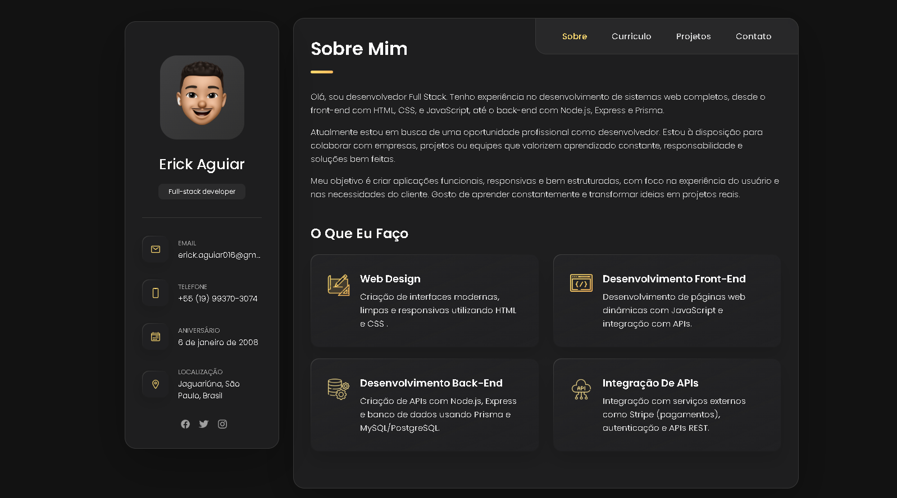

# 💼 Portfólio Profissional - Erick Aguiar

Bem-vindo ao meu portfólio! Este projeto foi desenvolvido para apresentar minhas habilidades, experiências e projetos como desenvolvedor Full Stack.

## 📌 Sobre

Este site foi criado com foco em um design moderno, responsivo e funcional. Nele você encontrará informações sobre mim, minhas habilidades, projetos realizados e formas de contato.

## 🚀 Tecnologias Utilizadas

- **HTML5**
- **CSS3**
- **JavaScript Vanilla**

## 🧩 Funcionalidades

- Navegação por seções com transição suave
- Modal de depoimentos
- Filtro de projetos por categoria
- Formulário de contato com validação
- Layout responsivo para todos os dispositivos

## 📄 Seções do Site

- **Sobre Mim** – Informações pessoais e trajetória profissional
- **Habilidades** – Principais tecnologias e ferramentas que domino
- **Projetos** – Exibição de projetos pessoais e profissionais
- **Currículo** – Minha trajetória como estudante e informações profissionais
- **Contato** – Formulário para envio de mensagens

## 📷 Prévia

 <!-- Atualize com a imagem correta, se desejar -->

## 📁 Como Executar Localmente

```bash
# Clone o repositório
git clone https://github.com/erickaguiar06/portfolio

# Acesse a pasta do projeto
cd portfolio

# Abra o index.html em seu navegador (clique duas vezes ou use um servidor local)
```

### 🌐 Acessar Online (GitHub Pages)

Você também pode acessar o projeto diretamente pelo link no botão **"About"** do repositório, no canto superior direito da página GitHub:

➡️ [https://seu-usuario.github.io/portfolio](https://seu-usuario.github.io/portfolio)